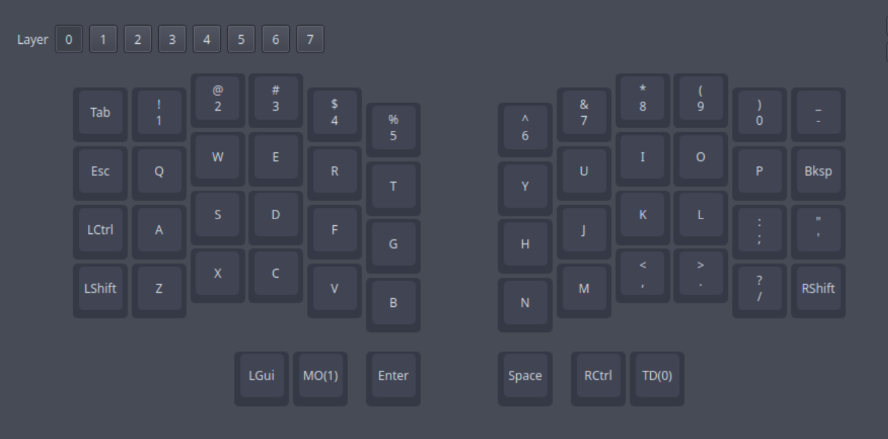

# Silakka 54 keymap

Basic keymap for silakka 54 split keyboard. Meant for use in Vial.
This is far from finished, and is only my first attempt at a keymap. There are some issues I am facing in Github issues.

## Layers

### Layer 0

Layer 0 is the alpha layer, based on QWERTY.

### Layer 1

Layer 1 is the nav layer, including arrow keys, delete, and media keys. The naviagation is based on Vim keybinds. This layer is activated by pressing MO(1), the middle button on the left thumb cluster.

### Layer 2

Layer 2 has all the function keys, as well as some punctuation that is missing. On the left side, there is mostly programming punctuation (i.e. brackets). The right side has a few other punctuation keys missing. This layer is activated by pressing the middle button of the thumb cluster on each hand (MO(1) and RCtrl).

